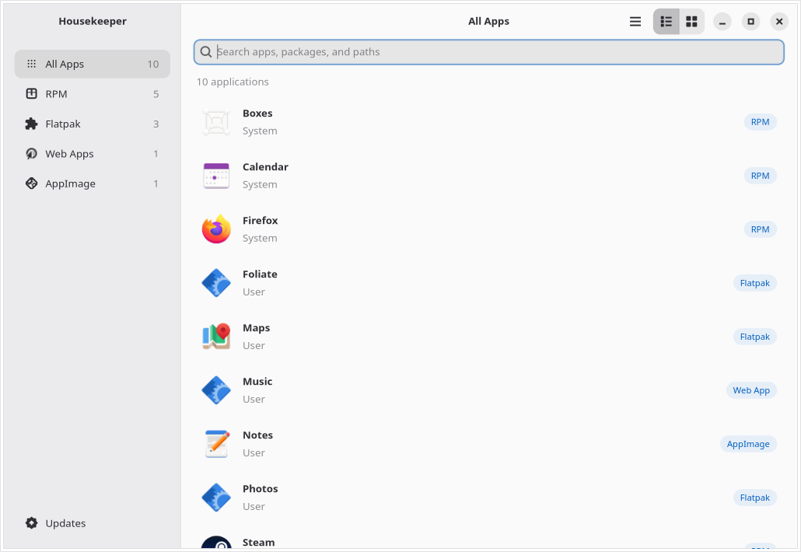
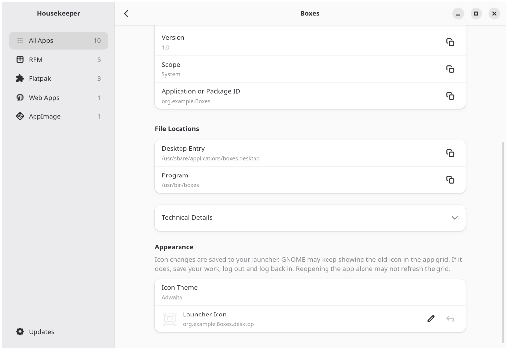
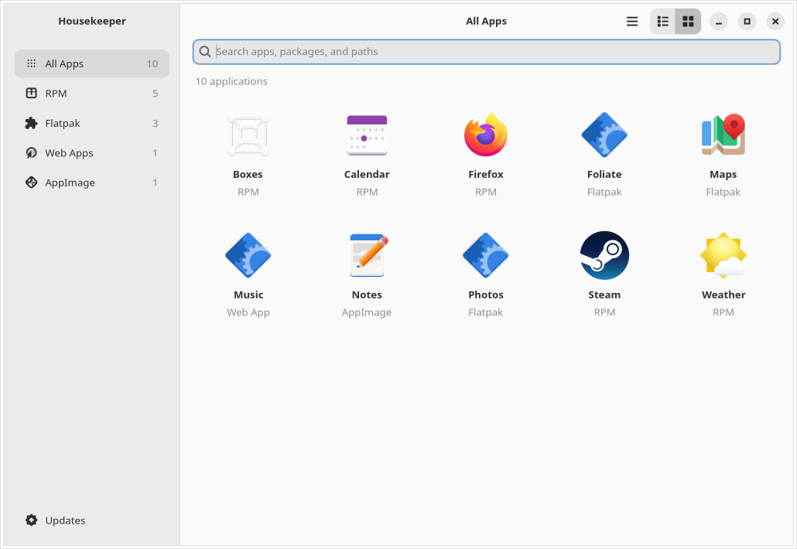
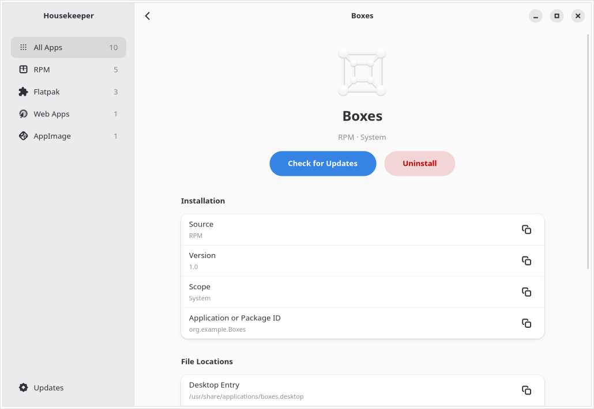
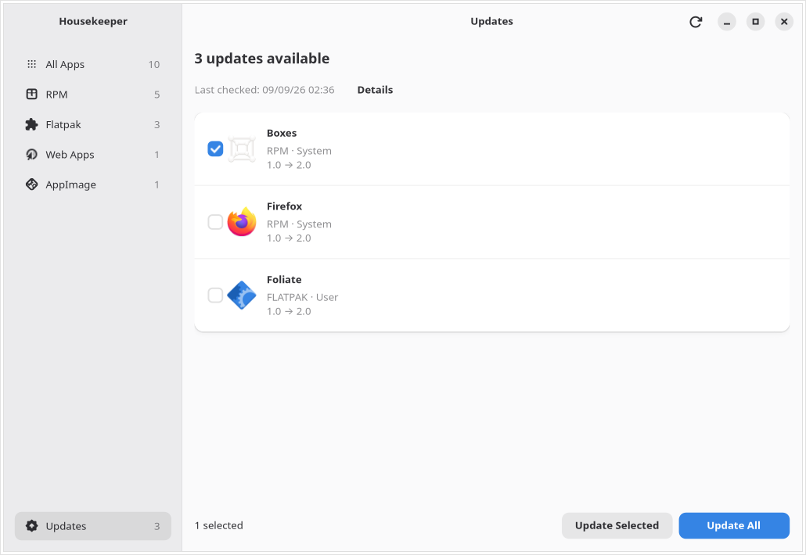

# Housekeeper

A lightweight GTK 4 application for understanding where your desktop applications
come from, where their files live, and how to update or remove them correctly.

Housekeeper combines desktop entries with supported installation providers. It
recognizes RPM packages, Flatpak applications, independent AppImages, Chrome and
Chromium web apps, PWAsForFirefox, and Steam game shortcuts.



## Features

- Search applications by name, package identity, or file location.
- Switch between a list and an icon grid, with source filters and adaptive navigation.
- Inspect versions, installation scopes, desktop entries, and executable paths.
- See the icon theme or custom image used for an app, and any explicit launcher
  GTK theme override. Change or restore each launcher's icon.
- Include hidden and auxiliary entries, with explanations of their visibility.
- Preview RPM and Flatpak removal, preserving personal application data.
- Check for RPM and Flatpak updates beside the uninstall action, then review versions
  and dependency changes before confirming an update.
- Move precisely identified, user-owned AppImage files and launchers to Trash.
- Open the appropriate browser or Steam manager for externally managed applications.

Sidebar categories such as **RPM** and **Flatpak** identify installation sources.
The second category follows the host's native package family: **RPM** on Fedora
and openSUSE, **DEB** on Ubuntu/Debian, **Pacman** on Arch, **APK** on Alpine, and
corresponding names for other recognized families. It uses `ID` and `ID_LIKE`
from `os-release`, falling back to **System Packages**. A category whose inventory
provider is not implemented explains this when opened; its label does not enable
package detection, updates or removal. Unverified applications remain in **Other**.
The separate **System** and **User** labels describe installation scope; Flatpak
applications can use either scope.

Housekeeper does not install new applications, perform system release upgrades,
clean application data, or list every command-line package. It never scans the
entire disk looking for executables. Application updates can install or upgrade
the dependencies listed in their confirmation preview.

## Appearance and application icons

The **Appearance** group at the bottom of app details shows the icon theme used
for lookup, or **Custom Icon** for a replacement image. Explicit launcher GTK theme
overrides appear only when present. The icon file path is in **Technical Details**.
Use the pencil beside **Launcher Icon** to select an image, or the undo button to restore the original.
Images are saved under the user's data directory, and launcher changes affect
only that user. Apps with multiple launchers have a separate control for each.
GNOME may keep the old icon in its app grid even after the launcher is saved.
If that happens, save your work, log out and log back in; reopening the app alone
may not refresh the grid. This reminder appears in Appearance and is available
from **GNOME Tip** after changing or restoring an icon.



## Screenshots







## Requirements

- Python 3.10 or newer, with PyGObject
- GTK 4.12 or newer
- libadwaita 1.4 or newer
- A graphical desktop session; GNOME Shell itself is not required

RPM ownership uses the optional Python RPM bindings. Direct RPM removal additionally
requires PackageKit, its introspection bindings, a compatible backend, and Polkit.
Flatpak support uses the optional libflatpak introspection bindings; update previews
require libflatpak 1.9.1 or newer. Missing providers
leave the rest of the inventory usable.

The initial system-package removal target is Fedora Workstation 43 and 44.
See [compatibility](docs/compatibility.md) for other environments and limitations.

**Current native-removal limitation:** the tested Fedora PackageKit backends cannot
provide the required dependency-safe removal plan: Fedora 43 rejects the no-cascade
request, and Fedora 44 returns an empty preview. Housekeeper retains the application
and gives terminal management guidance. Direct RPM removal must not be advertised
as verified on these backends. Flatpak and AppImage follow independent paths.

## Build and run on Fedora

```sh
sudo dnf install python3-gobject gtk4 libadwaita meson ninja-build glib2-devel gettext
sudo dnf install python3-rpm PackageKit PackageKit-glib flatpak-libs
meson setup build --prefix=/usr
meson compile -C build
./build/housekeeper-dev
```

The development launcher runs an incremental build before starting, so GTK resources
and settings schemas stay in sync with the Python source. A failed build stops startup.

The second installation command enables optional integrations. Build tools are not
needed when installing a release RPM. The launchers always use `/usr/bin/python3`,
including when a Conda environment is active, and work from any current directory.

The development launcher uses build-tree resources and schemas. To test without
saving preferences, launch it with `GSETTINGS_BACKEND=memory`.

To install a downloaded release package:

```sh
sudo dnf install ./housekeeper-0.1.5-1.fc44.noarch.rpm
```

Install the build matching your Fedora release. GitHub release packages do not
configure an automatic update repository. To remove Housekeeper itself, use
`sudo dnf remove housekeeper`.

## Development and validation

```sh
sudo dnf install python3-pytest
PYTHONPATH=src /usr/bin/python3 -m pytest
meson test -C build --print-errorlogs
ruff check src tests build-aux
ruff format --check src tests build-aux
mypy
```

Install Ruff and mypy in a development environment; they are not runtime dependencies.
GUI smoke tests use synthetic applications and perform no removal:

```sh
GTK_A11Y=none GIO_USE_VFS=local \
  dbus-run-session --config-file=tests/session.conf -- \
  /usr/bin/python3 tests/smoke_ui.py
```

For CI without a display, put `xvfb-run -a` before `dbus-run-session`. This smoke test
checks layout and interaction; it does not replace a real screen-reader test.

See [testing and releases](docs/testing.md) for disposable package-manager tests,
RPM builds, and the release checklist. Never run integration fixtures on a personal
system; their harness explicitly requires a disposable container.

## Privacy and behavior

Housekeeper keeps its inventory in memory and preferences in GSettings. Successful
update checks are cached locally in `$XDG_CACHE_HOME/housekeeper/updates.json`
(normally `~/.cache/housekeeper/updates.json`), including app identities and previews.
Deleting this cache resets the saved update results. It has no
telemetry, account, background service, or automatic network scan. Package managers
and explicitly opened external managers may use their own network connections.

`HOUSEKEEPER_DEBUG=1` enables diagnostic logging. Review logs before sharing them:
application names, paths, and package-manager errors can identify installed software.

All maintained repository prose, comments, and interface text are English.
The gettext structure is ready for future translations; version 0.1 is English-only.

## License

MIT; see [LICENSE](LICENSE). AppStream metadata is CC0-1.0. Application screenshots
show synthetic inventory data; third-party application icons retain their original licenses.

## Update authorization and diagnostics

System updates use the desktop's Polkit authentication dialog when required by
system policy. Authenticate there with a password or a configured fingerprint;
Housekeeper never collects credentials or runs the entire interface through sudo.
User Flatpak updates normally do not require administrator authorization. Existing
authorizations and system policy can allow an update without displaying a prompt.

Update failures are logged with the application, provider, and backend error in
`~/.local/state/housekeeper/housekeeper.log` (or under `$XDG_STATE_HOME`). The log
rotates at 1 MiB, retaining two backups. If file logging is unavailable, errors
remain available in the launching terminal. Use the complete result error and this
log when reporting a failure; a missing prompt alone does not establish its cause.
