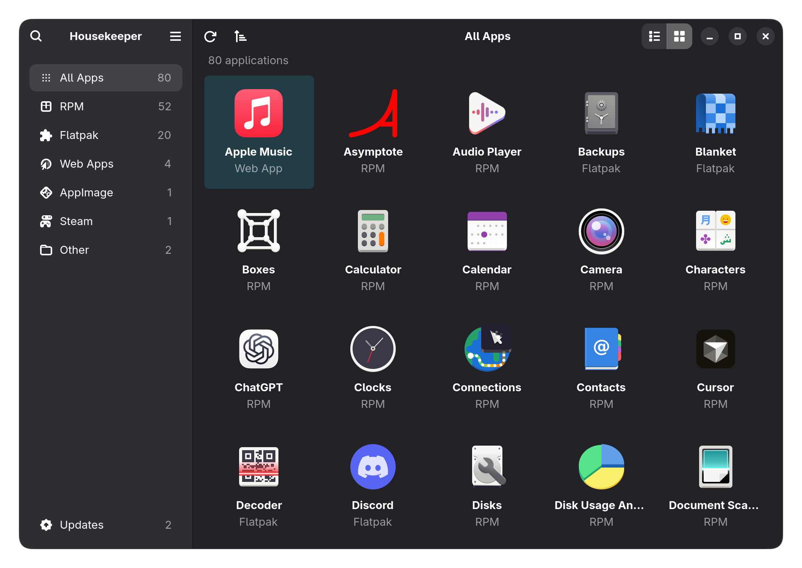

#  Housekeeper

[](https://github.com/yuelinxin/housekeeper/releases/latest)
[](https://copr.fedorainfracloud.org/coprs/yuelinxin/housekeeper/)
[](LICENSE)

A simple, unified app manager for the GNOME desktop. Discover, install, and manage
applications from different sources in one clean interface.

Install native packages and Flatpak apps, add website launchers, import AppImages,
and manage software sources. Browse everything in a searchable inventory, with
update and removal actions where supported. Housekeeper recognizes RPM, DEB,
Pacman and APK packages, Flatpak and Snap applications,
independent AppImages, Chrome and Chromium web apps, PWAsForFirefox, and Steam game shortcuts.

<p align="center">
  
  
</p>

## Features

- Browse a searchable list or grid, filter by source, and sort by name, size, or Last Updated.
- Open search with Ctrl+F and Preferences with Ctrl+comma; choose automatic or manual list refresh.
- Keep browsing, launching, and managing apps while the inventory refreshes in the background.
- Install apps from any page with the header's + button and shared type selector; refresh the app list from the sidebar menu.
- Search native and Flatpak apps by name or keyword, review their source and scope, and install the selected app with its dependencies.
- Add Chrome or Chromium website launchers and import AppImages, with automatic or custom desktop icons.
- Manage system and Flatpak software sources in Preferences; enable or disable sources and import Flatpak repository files or HTTPS links.
- Inspect versions, file locations, installation scope, and hidden entries.
- Open apps from their details page and see available updates beside their names.
- Customize launcher icons and restore the originals.
- Preview RPM and Flatpak updates and removal where supported, preserving personal data by default.
- Choose whether to keep or delete user data when uninstalling a Flatpak app.
- Choose manual or on-entry update checks, daily or weekly, for RPM and Flatpak.
- Move eligible AppImages and verified Housekeeper website launchers to Trash; use external managers for other web apps and Steam games.

## Current support

Housekeeper can install native packages through PackageKit and apps from configured
Flatpak sources. AppStream catalogues provide app names, descriptions and icons;
search falls back to package names or Flatpak IDs when catalogue matches are unavailable.
Native installation requires a working PackageKit backend for the host distribution;
immutable systems retain external package management. Housekeeper does not perform
system upgrades. Flatpak removal can delete the current user's app data and permissions
when explicitly selected. Software sizes exclude shared runtimes and dependencies;
unavailable sizes and update dates stay unknown.

Website launchers need only a URL and default to Chrome, with Chromium as an option.
They open in their own browser window and use the website's icon when available.
They do not register a browser-installed PWA. Verified launchers created by Housekeeper
can be uninstalled while keeping browser data and icons. AppImages use the standard
executable icon; both allow a custom icon. AppImage imports copy the selected file
to `~/AppImages`, make it executable, and create a
desktop launcher without running the file. Steam opens its library; Snap search
opens the selected app in the Snap Store to finish installation.

Update and removal support varies by source. DEB, Pacman, APK, and Snap provide
external update/removal instructions. Direct RPM removal is unavailable on the tested
Fedora backends; Housekeeper provides guidance instead. See
[compatibility](docs/compatibility.md) for supported environments and limitations.

## Requirements

- Python 3.10+ with PyGObject, GTK 4.12+, and libadwaita 1.4+
- A graphical desktop session; GNOME Shell itself is not required
- Optional RPM, PackageKit, and Flatpak integrations for their respective sources
- Optional AppStream bindings and distribution catalogues for application search metadata

## Install on Fedora

On Fedora 43 or 44, enable the [COPR repository](https://copr.fedorainfracloud.org/coprs/yuelinxin/housekeeper/)
and install Housekeeper:

```sh
sudo dnf copr enable yuelinxin/housekeeper
sudo dnf install housekeeper
```

New releases are available through normal system updates, or run
`sudo dnf upgrade housekeeper` to update Housekeeper directly.
To uninstall Housekeeper, run `sudo dnf remove housekeeper`.

## Build and run

On Fedora:

```sh
sudo dnf install python3-gobject gtk4 libadwaita meson ninja-build glib2-devel gettext
sudo dnf install python3-rpm PackageKit PackageKit-glib flatpak-libs appstream appstream-data
meson setup build --prefix=/usr
meson compile -C build
./build/housekeeper-dev
```

The second command enables optional integrations. The development launcher rebuilds
changed resources before starting. Use `GSETTINGS_BACKEND=memory` to try it without
saving preferences.

## Development

See [testing and releases](docs/testing.md) for test commands, disposable integration
environments, and packaging. [Architecture](docs/architecture.md) describes the
implementation; [validation](docs/validation.md) records completed checks and known gaps.
Run package-manager integration tests only in their disposable containers.

## Privacy and diagnostics

Housekeeper has no telemetry, account, or background update service. Preferences
and update results are stored locally. Package searches, installations, and update
checks may contact configured repositories; Snap searches contact the Snap Store through snapd.
Adding a website launcher may fetch its page and icon directly, without browser cookies
or a third-party icon service.
System operations use the desktop's Polkit authentication dialog when required;
Housekeeper never collects passwords.

Update errors are logged in `~/.local/state/housekeeper/housekeeper.log`
(or under `$XDG_STATE_HOME`). Set `HOUSEKEEPER_DEBUG=1` for additional diagnostics.
Review logs before sharing: they can include application names and file paths.

The interface is currently English-only, with gettext support for future translations.

## License

[MIT](LICENSE). AppStream metadata is CC0-1.0. Screenshots use synthetic application
inventories; third-party icons retain their original licenses.
